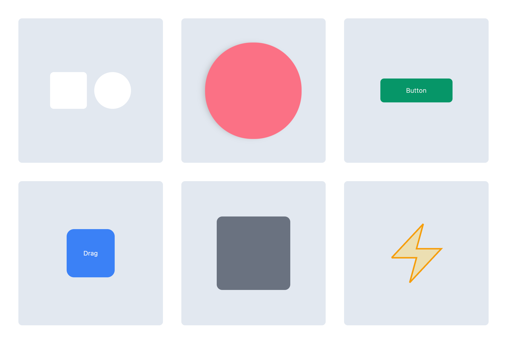

# Framer Motion Simple Example



## Example

1. Fade Up/Down
2. Keyframe Animation
3. Button Animation
4. Drag
5. Scroll Animation
6. SVG Animation
7. Paragraph Animation

## Run Locally

1. Install dependencies
   ```sh
   npm i
   ```
2. Spin up dev server
   ```sh
   npm run dev
   ```

## Reference

- [Framer Motion Docs](https://www.framer.com/motion/introduction/)
- [Framer Motion (React) - The Basics](https://www.youtube.com/watch?v=31y7-k3ZG0g&ab_channel=rithmic)